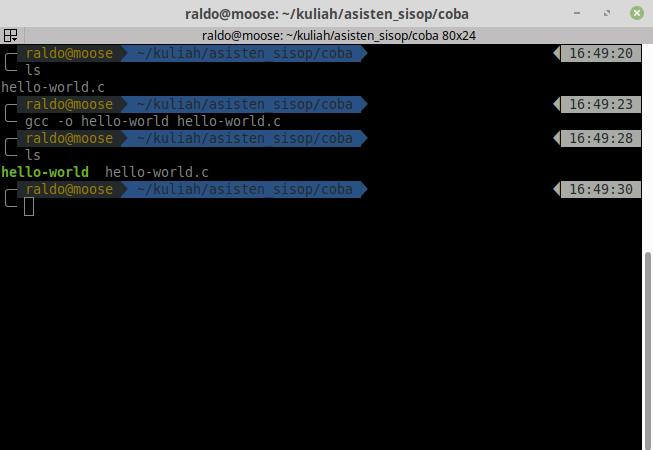
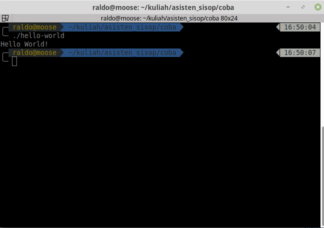

# Compile C Program

### Program Code
`hello-world.c`
```C
#include <stdio.h>

int main(){
  printf("Hello World!\n");
  return 0;
}
```

### Compiling
`gcc -o {outfile} {infile}`

```bash
$ gcc -o hello-world hello-world.c
```
#### contoh


### Execute
```
$ ./hello-world
```

### Result
```
Hello World!
```

#### contoh

